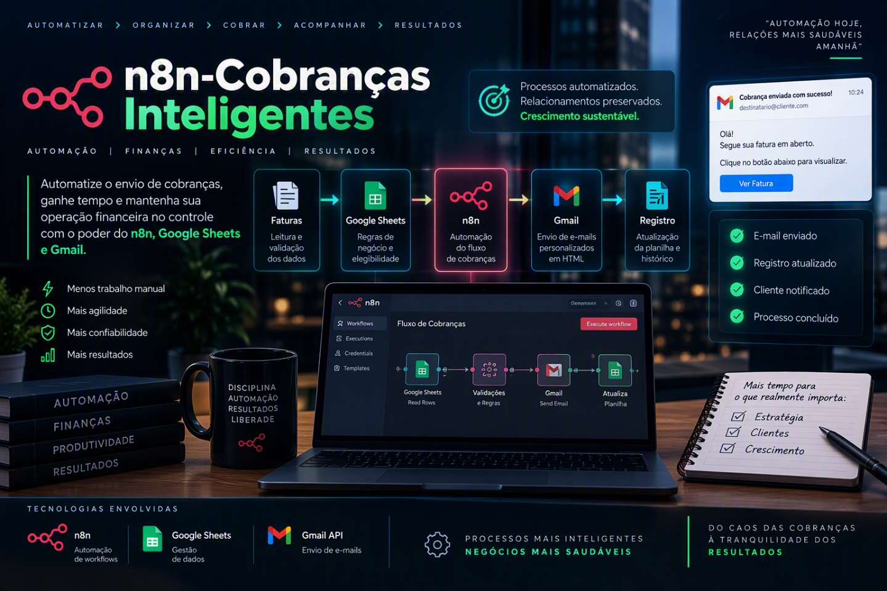

<p align="center">
  
</p>

<p align="center">
  
  
  
  
  
</p>

# n8n-Cobranças Inteligentes

> **Autor:** Rafael Ornelas Tozato  
> **Governança Técnica:** Branch protection ativa (`https://img.shields.io/badge/branch%20protection-active-success`)  
> **Contexto do Projeto:** Desafio Criativo desenvolvido na plataforma DIO (Digital Innovation One).  

Automação financeira inteligente com n8n, Google Sheets e Gmail.

---

## 📋 Objetivo do Projeto

Projetar e estruturar um fluxo de trabalho automatizado para o envio de faturas e cobranças vencidas, garantindo confiabilidade, tratamento adequado de exceções e eficiência operacional para a equipe financeira.

O workflow realiza a leitura das faturas, aplica regras de validação e elegibilidade, gera uma mensagem de cobrança em HTML, envia o e-mail ao cliente e registra o envio na planilha.

---

## 🛠️ Ferramentas e Escopo

* **Público responsável:** Equipe financeira e de atendimento ao cliente.
* **Ferramentas envolvidas:**
  - Google Sheets
  - n8n
  - Gmail API

---

## 🔄 Fluxo de Automação

O processo é executado automaticamente todos os dias às 08:00.

```text
Schedule Trigger
        ↓
Google Sheets - Ler Faturas
        ↓
Filter - Email valido
        ↓
Filter - Sem pagamento automatico
        ↓
Filter - Faturas vencidas
        ↓
Set - Variaveis da mensagem
        ↓
Code - Template HTML
        ↓
Gmail - Enviar cobranca
        ↓
Google Sheets - Marcar enviado
